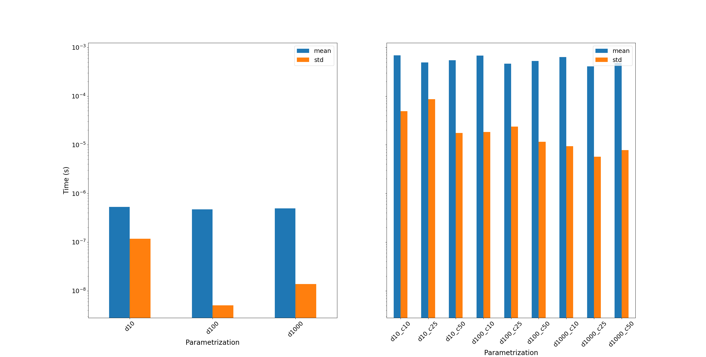

FFrame
======

FFrame is a quick comparison between two algorithms.
Once implemented, one was extremely inefficient, and the second much faster!
The goal was to discretize a function's domain and image
given some allowed values.

1. Look up table *like* method. 
    It comes down to populating a list of allowed values, 
    iterating over the discretized domain's image values, 
    and finding the nearest allowed value.
    This method would be more interesting if the values need
    to be used many times, instead of just once to discretize the 
    image values. One needs to be careful to use a good value for
    the image granularity as to properly populate the allowed_values.
2. Iterator method.
    This is much simpler. It is basically a one-liner.
    It not only gets rid of a bunch of boiler-plate code,
    but it runs 1000x faster. More on this in the comparison 
    of the two methods. Furthermore, there are no mismatch issues 
    to deal with, unless the function isn't defined in one of the 
    domain points.

Comparison of performance
-------------------------
- :math:`\frac{ \mathrm{sin}(x) }{x}`

Analysis:

- :math:`\mathrm{sin}(x)\cdot x**3`

Analysis:

.. image:: images/x3sinx_ana.png
   :width: 400
   :alt: x3sinx_ana

